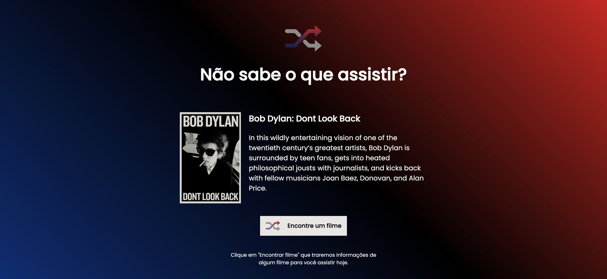

<h1>Rocketflix</h1>

<h2>✅ Sobre</h2>

Rocketflix é uma aplicação que tem como objetivo trazer filmes aleatórios ao usúario quando o botão de busca por um filme é cliacdo.

<h2>✅ Objetivo do projeto</h2>

Bom é sempre bom praticar os conceitos e nesse projeto os pontos mais importantes foi construir uma aplicação com um código javascript bem moderno e o mais clean possível, foi feito o consumo de um api, assim como o conceito de mobile-first

<ul>
 <li>Html</li>
 <li>Javascript</li>
 <li>Css</li>
</ul>

<h2>✒️ Autor</h2>

✔️Gabriel Viana
